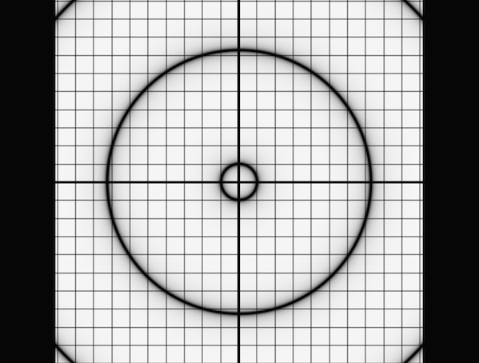
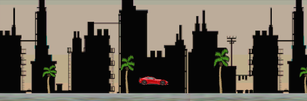
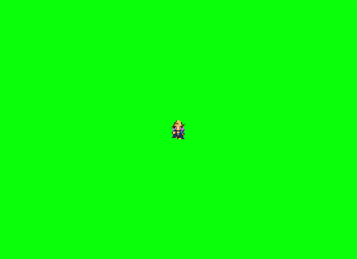

glsl-qwqz
=========

_libqwqz_ is a bare bones OpenGL ES 2.x utility library written in C. It has minimal facilities for VBO batch sprite rendering, PNG texture loading, shader compilation, and timers. Along with the base library, this project packages several open source frameworks, _chipmunk physics_, _libmodplug_, _protothreads_, _spine animation_, _zlib_ and, _unzip_. By combining these frameworks it is possible to create game like applications that are cross-compilable to several platforms, namely: _OSX_, _iOS_, _GNU Linux_, _HTML5 emscripten_, _Android_. Below are details on each of the example projects included which document further details on how _libqwqz_ can bridge between the mentioned frameworks to create simplistic games / demos.

### Fullscreen Quad Shader Test

The `test-src` directory contains an application that will render a specified set of fragment shaders, the intended behaviour is very much similar to existing webpages glsl.heroku.com and shadertoy.com. In fact, most of the shaders included in the `assets/shaders` directory are directly ripped from one of those sites, and slightly modified to run within this application. To build the test application run...

    make test

You should be presented with a window that is cycling through several test shaders:

### Sidescroll

The `sidescroll-src` directory contains a game very much in the typical "run and jump" genre. It serves as an example of how one might use the _spine_ animation framework to build out a level, then bring the animations to life by bridging the sprites into a physics engine to provide collision detection. Build and run using...

    make sidescroll

It will begin the game, press spacebar or tap the window to make the car jump up and forward, try to stay in the air as long as you can!

### Networked Tilemap Maze

The `networked-tilemap-maze-src` directory is a WIP example of how to communicate player position over a TCP socket to create a multi-player maze exploration game. Currently it serves as a good example of how to do basic atlas-spritesheet based frame animation. It can be built using...

    make ntm

You should be presented with a screen of a character cycling through all of its animations. Use your pointer device to click and drag the player around the screen.

    qwqz_engine = qwqz_create();

